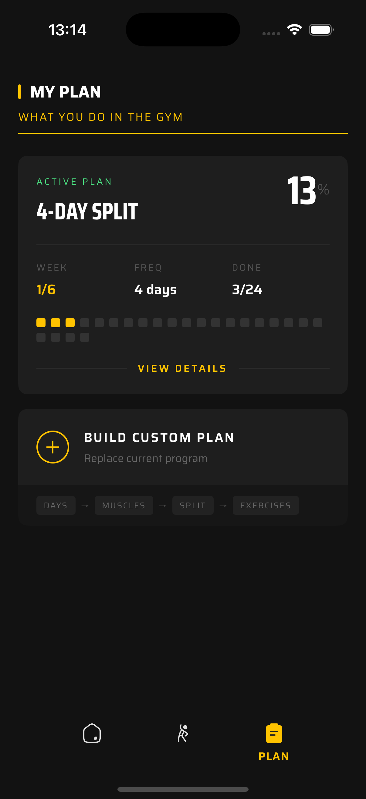
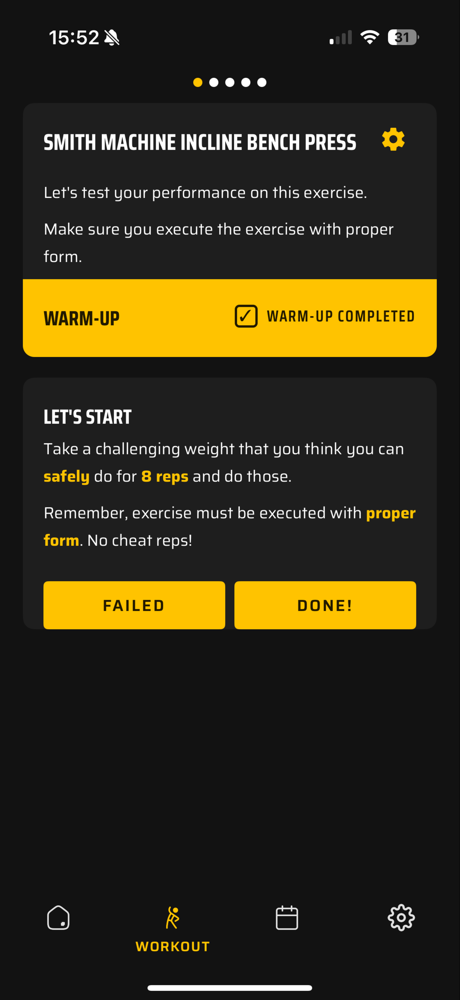
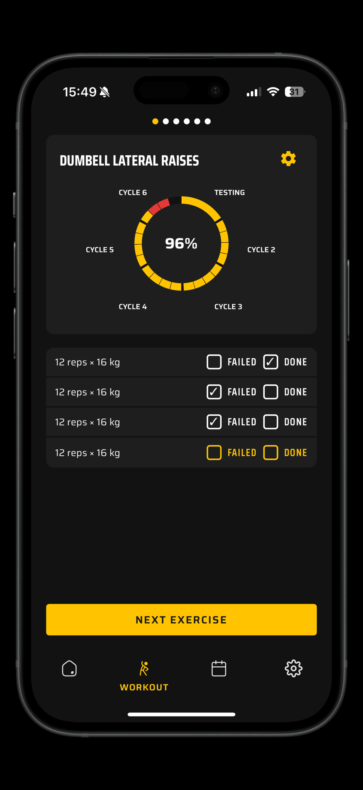

<div align="center">

# LiftCoach

**Stop guessing. Start progressing.**

[](#)
[](https://www.typescriptlang.org/)
[](https://reactnative.dev/)
[](https://expo.dev/)
[](LICENSE)
[](CONTRIBUTING.md)

An iOS app for gym-goers who show up consistently but lack structured training plans, so their results plateau. LiftCoach tells you exactly what to do each workout and intelligently adjusts your program based on your performance, feedback, and lifestyle to keep you progressing.

</div>

---

<div align="center">
  
  &nbsp;&nbsp;
  
  &nbsp;&nbsp;
  
</div>

## Features

**🏋️ Smart Program Generation** - No training knowledge needed. Just tell the app your experience level, schedule, and which muscles you care about most, it generates a fully balanced, optimally structured program for you.

**💪 Strength Calibration** - "Am I training hard enough?" LiftCoach tests your strength and tells you exactly how heavy to go, so every set counts from day one.

**📈 Automatic Progressive Overload** - The app tracks your performance and adjusts weight and reps week to week. You always know you're training at the right intensity.

**🎯 Real-Time Workout Guidance** - Each workout shows exactly what to do: exercise, weight, sets, reps. Just follow along and mark sets as done or failed.

**🧠 Lifestyle-Aware Progression** - Rate your sleep and diet after each workout. LiftCoach factors lifestyle into progression decisions, no punishment for a bad week.

**🔄 Mid-Workout Flexibility** - Swap exercises on the fly with smart replacements that match the same movement pattern and muscle group.

**📱 Fully Offline** - All data lives locally on your device via SQLite. No account needed. No backend required. Your data is yours.

## Why I Built This

I've been lifting for years and the single biggest unlock for me was following a structured plan with progressive overload. It transformed both my strength and physique. But when I look around the gym, I see the same story everywhere: people who show up religiously but train without any structure, doing random exercises at random weights, and wondering why nothing changes.

Most fitness apps are just workout logs. That's great if you already know what you're doing, but a lot of people don't. They don't know how to program training, how to periodize, how to progressively overload, or even where to start. Logging reps for a bad plan doesn't make it a good plan.

I dug into the latest exercise science research, combined it with what I've learned through my own training, and realized that effective gym progression is surprisingly algorithmic. The rules around volume, intensity, progressive overload, and deload timing are well-established - they just need to be applied consistently. That's exactly what a program can do.

LiftCoach is for the dedicated people who already have the hardest part figured out - showing up - but need the science-backed structure to make that effort actually count.

## Quick Start

```bash
git clone https://github.com/tomkis/liftcoach.git
cd liftcoach
pnpm install
pnpm run ios
```

> Requires Node >=22 and pnpm 9.7+

## Contributing

Contributions are welcome! Feel free to open an issue or submit a PR.

## License

Apache 2.0 - see [LICENSE](LICENSE) for details.
