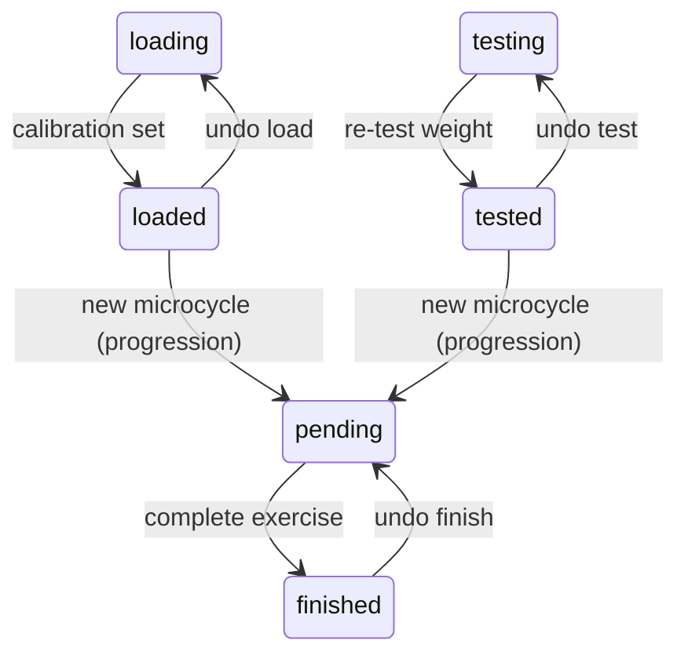

# Exercise State Machine

## States

| State | Description |
|-------|-------------|
| `loading` | First time exercise appears, user must perform calibration set |
| `testing` | Re-testing weight at start of new mesocycle, user performs calibration set |
| `loaded` | Calibration set recorded from loading state |
| `tested` | Calibration set recorded from testing state |
| `pending` | Working sets generated, user performs reps |
| `finished` | All sets assessed, exercise complete |

## Transitions

## Notes

- `loading` and `testing` are calibration states where the system determines appropriate weight
- `loaded` and `tested` retain the calibration data (`loadingSet`) used to generate working sets
- `pending` exercises have a `progressionType` indicating how weight/reps were progressed
- `finished` exercises store an assessment (`ideal` or `hard` with a tag)
- Undo finish resets all sets to `pending` and clears assessment data; `progressionType` is preserved
- Undo load/test discards calibration sets and clears loading set data
